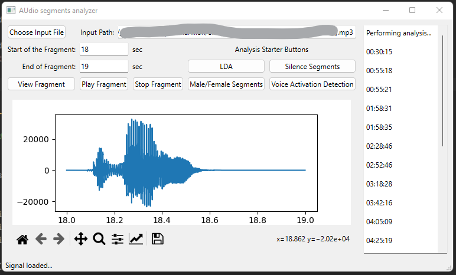

# Audio Segments Analyzer

School project KIV/AZS subject

Simple desktop application which allows user to match in audio input similar patterns based on pattern that user choose.
It can be useful when you want to cut large audio file such as recorded speech or audiobook.

## how to use

1) load audio file
2) set the start and end of the fragment you want to use as pattern
    - view Fragment or play his sound
3) start the analysis
    - **IMPORTANT info** - implemented are:
        - `Male/female Segments`
        - `Voice Activation Detection`

